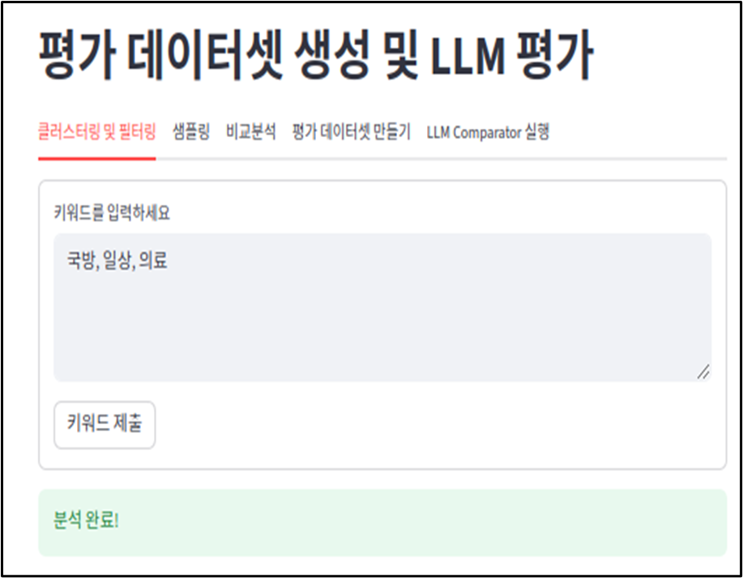
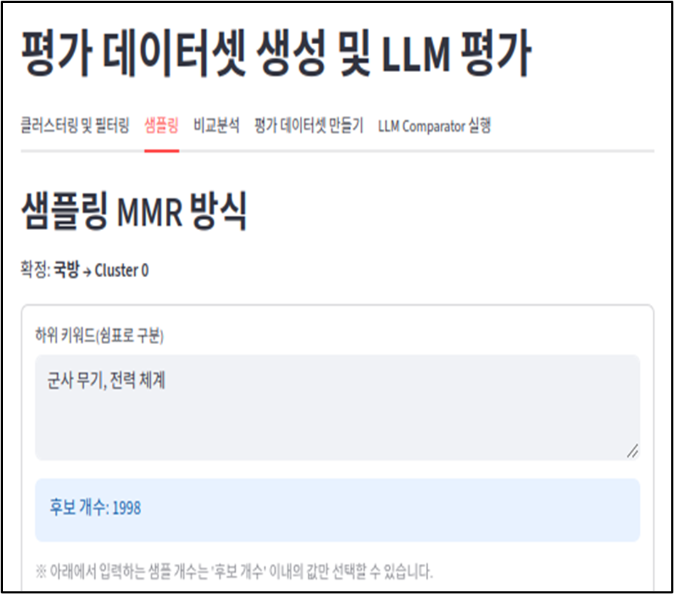
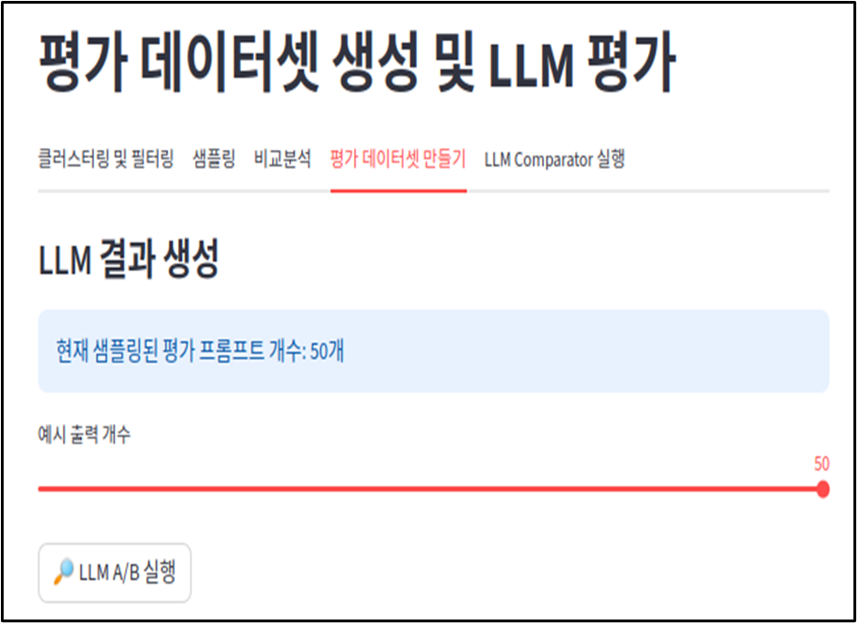
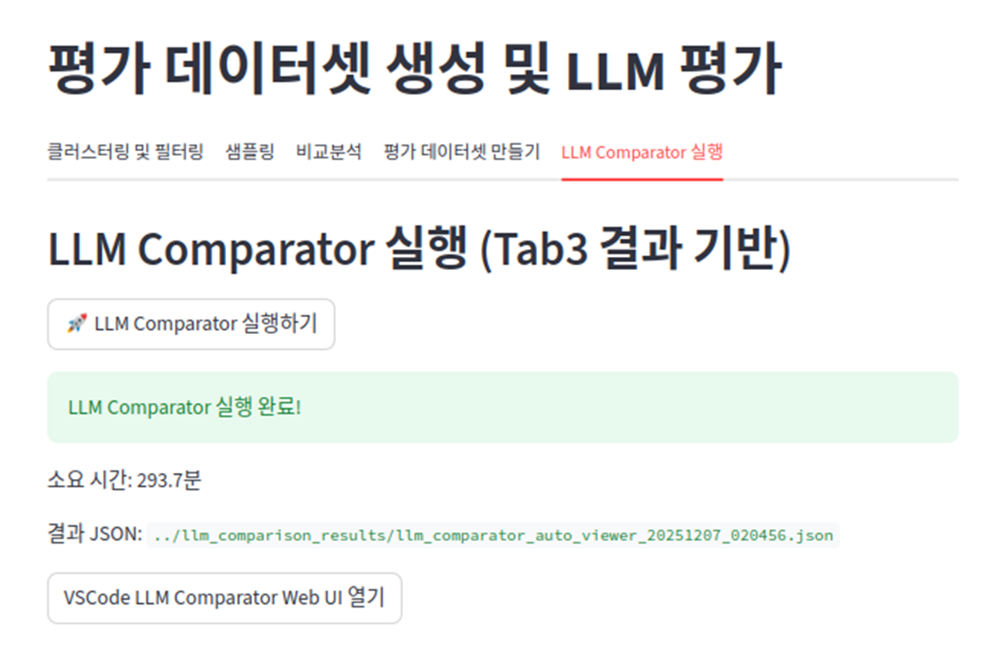
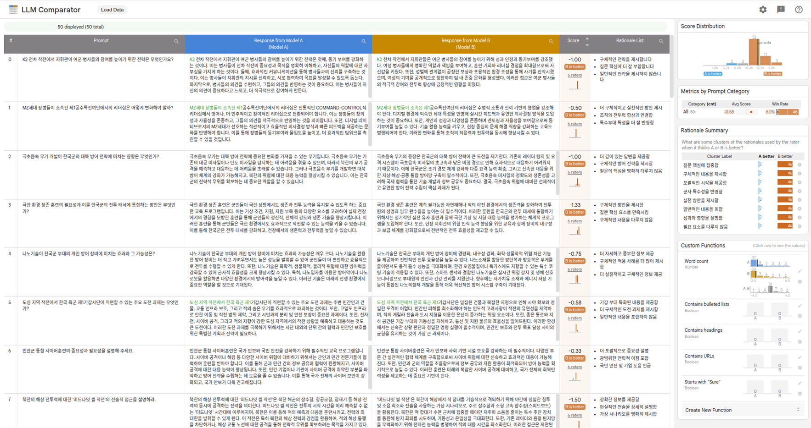

# 실 운영 데이터 기반 LLM 성능 자동 평가 및 최적 모델 선정 지원 시스템  
(국방 도메인 적용)

본 프로젝트는 **실제 운영 환경에서 수집된 사용자 질의 데이터를 기반으로**, 다수의 LLM을 자동으로 비교·평가하고 **우리 도메인에 가장 적합한 LLM을 선택할 수 있도록 지원하는 시스템**을 구현한다.

공개 벤치마크 점수에 의존하던 기존 방식의 한계를 극복하고, **실제 사용자 입력 특성을 반영한 평가 데이터셋 자동 생성 → LLM A/B 비교 → 설명 가능한 평가 결과 제공**을 목표로 한다.

---

## 1. 연구 배경 (Background)

최근 LLM은 기업·공공·국방 분야 전반에 빠르게 도입되고 있으며,  
각 조직은 **자신의 데이터와 목적에 특화된 LLM 선택**이라는 과제에 직면해 있다.

그러나 현실적으로 다음과 같은 문제가 존재한다.

- 공개 벤치마크는 실제 서비스 환경을 충분히 반영하지 못함
- 벤치마크 점수가 높아도, 특정 도메인(예: 국방)에서는 성능이 저조할 수 있음
- 평가 데이터셋을 수작업으로 구축하는 것은 시간·비용 측면에서 비효율적
- 새로운 LLM 출시 시, “교체할 가치가 있는지”를 객관적으로 판단하기 어려움

### 핵심 연구 질문
> **우리 데이터 환경에 가장 적합한 LLM을 어떻게 자동으로 판단하고 선택할 수 있는가?**

---

## 2. 전체 시스템 개요

본 시스템은 다음 두 개의 핵심 단계로 구성된다.

### 소주제 1  
**사용자 입력 기반 LLM 평가 벤치마크 데이터셋 자동 생성**

- 실제 사용자 질의 데이터 클러스터링
- 키워드 기반 클러스터 선택
- MMR 기반 고품질 질의 샘플링

### 소주제 2  
**생성된 평가 데이터셋을 활용한 다수 LLM 자동 비교·추천**

- 동일 질의에 대해 LLM A/B 응답 생성
- LLM Comparator를 통한 자동 평가
- “어떤 모델이 더 좋은지 + 왜 좋은지” 설명 가능한 결과 제공

---

## 3. 시스템 파이프라인 상세

### 3.1 키워드 기반 클러스터링 및 필터링 (Tab 1)

- 사용자 질의 임베딩을 기반으로 클러스터링 수행
- 각 클러스터 내 질의들의 평균 임베딩 계산
- 입력한 **대표 키워드와 클러스터 간 코사인 유사도 계산**
- 키워드와 가장 유사한 클러스터 자동 추천
- 히트맵 시각화를 통해 직관적 분석 제공

📂 관련 코드
- `qa_cluster.py`
- `choice_cluster.py`
- `tab1_keyword_analysis.py`

### 결과 예시

<p align="center">
  
</p>

---

### 3.2 MMR 기반 질의 샘플링 (Tab 2)

선택된 클러스터 내부 질의들만 후보로 제한한 뒤, **MMR(Maximal Marginal Relevance) 알고리즘**을 활용해 샘플링을 수행한다.

MMR은 다음 두 요소를 동시에 고려한다.

- **Relevance**: 키워드와 얼마나 관련 있는 질의인가
- **Diversity**: 이미 선택된 질의들과 얼마나 다른가 (중복 제거)

조절 가능한 주요 파라미터:
- α (관련성 가중치)
- β (중복 억제 가중치)
- 하위 키워드 집계 방식 (max / mean / min)
- near-duplicate 제거 임계값

📂 관련 코드
- `mmr_select.py`
- `tab2_sampling.py`

### 결과 예시

<p align="center">
  
</p>

---

### 3.3 MMR vs Random 샘플링 비교 분석 (Tab 2-1)

MMR 샘플링의 효과를 검증하기 위해  무작위(Random) 샘플링과 비교 분석을 제공한다.

- 키워드별 유사도 분포 (KDE)
- 박스플롯 비교
- 상·하위 질의 예시 출력

이를 통해 **MMR이 키워드 적합도와 다양성 측면에서 우수함을 정성·정량적으로 확인**할 수 있다.

📂 관련 코드
- `tab2_1_comparsion.py`

### 결과 예시

<p align="center">
  
</p>

---

### 3.4 LLM A/B 응답 생성 (Tab 3)

MMR로 선정된 평가 질의(eval prompts)를 기반으로:

- 기존 LLM (Model A)
- 신규 또는 비교 대상 LLM (Model B)

두 모델에 동일한 입력을 제공하고 응답을 생성한다.

결과는 다음 형태로 제공된다.
- A/B 개별 응답 테이블
- 병합된 비교 테이블
- LLM Comparator 입력용 JSON 자동 생성

📂 관련 코드
- `model_a_response_qa.py`
- `model_b_response_qa.py`
- `tab3_eval_dataste.py`

---

### 3.5 LLM Comparator 자동 평가 (Tab 4)

LLM Comparator : **Judge LLM을 활용한 다단계 비교 평가**를 수행

#### (1) 응답 우수성 판단
- A/B 응답 순서를 바꿔가며 총 6회 비교
- 순서 편향(order bias) 제거
- 평균 점수 기반 우수 모델 판단

#### (2) 우수 이유 요약 (Bullet)
- Judge LLM이 “왜 더 좋은지”를 문장으로 요약

#### (3) 이유 클러스터링
- 유사한 평가 이유들을 군집화
- 각 모델의 강점·약점 패턴 시각화

📂 관련 코드
- `LLM_comparator/`
- `tab4_run_lc.py`

### 결과 예시

| | |
|:--:|:--:|
|  |  |

---


## 4. 실행 방법

```bash
pip install -r requirements.txt
streamlit run web_main.py